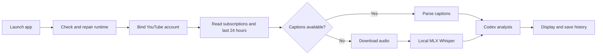

# YouTubeInsight

A native macOS client that monitors your YouTube subscriptions, analyzes every
new video from the last 24 hours, and keeps a local, searchable history.

[简体中文](README.md) · English

## Features

- Binds a YouTube account in the system browser with read-only Google OAuth.
- Reads every subscribed channel and discovers videos published in the last 24 hours.
- Refreshes every 15 minutes while the app is running, with an on-demand refresh button.
- Checks up to six subscribed channels concurrently. Discovery continues while one analysis runs, and newly found videos enter a newest-first priority queue with saved or already-attempted videos deduplicated.
- Still accepts individual YouTube, Shorts, and `youtu.be` links for manual
  analysis without requiring account binding.
- Checks the runtime at launch, automatically repairs missing or broken tools
  when possible, and shows actionable errors when user authorization is required.
- Uses human or automatic YouTube captions when available.
- Downloads audio and transcribes it locally with MLX Whisper when captions are unavailable.
- Uses the signed-in Codex CLI to produce one short overview card and five numbered point cards.
- Lets you choose Codex Sol, Terra, Luna, or a custom model, plus Low, Medium,
  High, Extra High, Max, or Ultra reasoning effort. Every automatic analysis
  uses the current selection.
- Uses plain language, short labels, and arrow flows; results are normally 250–350 characters and never exceed 400.
- Saves the URL, title, thumbnail URL, date, transcript source, transcript, and
  analysis locally, with thumbnails shown in history and detail views.
- Shows the app version and build number in the sidebar. Rebuilding after a
  source or resource update automatically generates a new build number.
- Opens the main window maximized to the current screen's usable area without
  entering a separate full-screen Space.
- Supports Simplified Chinese, Traditional Chinese, English, Japanese, Korean,
  Spanish, French, and German. Both the interface and new analyses follow the
  macOS language.

## How it works



History is stored at:

```text
~/Library/Application Support/YouTubeInsight/history.json
```

Temporary audio is removed after each run. Whisper models and tool caches remain
on disk so later runs do not download them again.

## Requirements

- Apple Silicon Mac
- macOS 13 or later
- Swift 5.10 or later for building
- [`uv`](https://docs.astral.sh/uv/) for isolated `yt-dlp`, `mlx-whisper`, and
  static ffmpeg fallback execution
- Codex CLI installed and signed in
- A Google Cloud project with YouTube Data API v3 enabled
- A Google OAuth **Desktop app** credential JSON file

The launch check validates these tools. When Homebrew is available, the app can
install or repair `uv`, Node.js/npm, and Codex CLI automatically. Codex account
sign-in still requires user authorization:

```bash
brew install uv
codex login
```

## Connect YouTube

1. Enable [YouTube Data API v3](https://console.cloud.google.com/apis/library/youtube.googleapis.com)
   in Google Cloud.
2. Create an OAuth client with application type **Desktop app** under
   **APIs & Services → Credentials**, then download its JSON file.
3. Open YouTubeInsight Settings, import the JSON, and choose **Bind account**.
4. Complete read-only authorization in the system browser.

The app uses PKCE with a loopback redirect. Access and refresh tokens are stored
in macOS Keychain and are revoked and deleted when the account is disconnected.
It immediately checks the previous 24 hours, then refreshes every 15 minutes
while running. Channel discovery is concurrent; each discovered batch enters a
newest-first queue while the single analysis worker starts immediately.

### Recommended installation and Keychain access

Keep `YouTubeInsight.app` in `/Applications` and always launch that installed
copy. Do not alternate between copies in a DMG, Downloads, or the source
`dist` directory. macOS may treat them as different applications and request
Keychain access repeatedly.

If prompts continue after choosing **Always Allow**:

1. Quit YouTubeInsight.
2. Open **Keychain Access**, then select **login → Passwords**.
3. Search for and open `com.local.YouTubeInsight.YouTubeOAuth`.
4. Under **Access Control**, choose `+`, add
   `/Applications/YouTubeInsight.app`, and save.

Local release packages are ad-hoc signed, so rebuilding or upgrading changes
the code identity and the new version may require one more confirmation.
**Allow all applications to access this item** suppresses confirmation but
also lets other local applications read the YouTube token, so it is not
recommended. A stable Apple Developer signature preserves the app identity
across upgrades.

For a one-off video, skip account binding and paste the URL into the
**Manual analysis** field in the main window. Manual and scheduled jobs share
the selected Codex model, reasoning effort, caption/Whisper pipeline, and local
history.

## Build and run

```bash
chmod +x scripts/build-app.sh scripts/run-tests.sh
./scripts/run-tests.sh
./scripts/build-app.sh
open dist
```

After building, drag `YouTubeInsight.app` into Applications and launch the
installed copy.

`CFBundleShortVersionString` in `Resources/Info.plist` controls the release
version. The build script derives `CFBundleVersion` from the latest source or
resource modification time, for example `1.6.4 (Build 20260728103000)`.
Unchanged content keeps the same build number. Set
`YOUTUBEINSIGHT_BUILD_NUMBER` to override it.

Optional end-to-end smoke test:

```bash
chmod +x scripts/smoke-test.sh
./scripts/smoke-test.sh "https://www.youtube.com/watch?v=XYgm-dNNrR8"
```

Check only the startup environment:

```bash
./scripts/smoke-test.sh --environment-only
```

The first captionless video downloads the selected Whisper model. Subsequent
runs reuse the model cache.

Starting with 1.6.3, caption and audio downloads reuse the video metadata
already fetched at the beginning of a run, avoiding repeated YouTube page
extraction. Captionless videos prefer a lower-bitrate audio stream suitable
for speech recognition. Built-in Codex models use a lean, ephemeral invocation
that skips plugin, rule, and user-configuration startup work. Local Whisper
remains the dominant cost for captionless videos; choose the `small` or `tiny`
model in Settings when speed matters more than maximum transcription quality.

Each scan pages through all subscriptions and reads channel upload playlists
with the low-cost `subscriptions.list`, `channels.list`, and
`playlistItems.list` endpoints. The app does not run after it is closed; the
next launch checks the previous 24 hours again.

Whisper output is read as plain text so non-standard numeric values in model
JSON metadata cannot invalidate an otherwise successful transcript.

## Language behavior

The app follows the macOS system language and respects per-app language
selection in System Settings. Unsupported languages fall back to English.
Restart the app after changing its language.

Saved analyses are not translated retroactively. Reanalyze a URL to create a
result in the newly selected language.

## Privacy and security

- Speech transcription runs locally.
- Analysis history remains on the Mac.
- YouTube OAuth tokens remain in macOS Keychain, and only the
  `youtube.readonly` scope is requested.
- Subscription and upload metadata is retrieved through YouTube Data API v3.
- The transcript is sent to the locally authenticated Codex CLI for analysis.
- YouTube, package, model, and Codex access require network connectivity.

See [SECURITY.md](SECURITY.md) for the trust model and reporting instructions.

## Troubleshooting

- **Missing `uvx`:** choose **Retry** on the startup screen. The app repairs it
  through Homebrew when available.
- **“Could not prepare npm”:** Finder-launched apps receive a smaller PATH than
  Terminal. The app now adds Homebrew and user tool directories automatically,
  and checks npm only when Codex CLI actually needs to be installed.
- **Codex analysis fails:** run `codex login` and confirm the configured model is
  available to the account. Model and reasoning availability can vary by
  account; switch to **Sol + Medium** or enter a supported custom model ID.
- **YouTube binding fails:** confirm the OAuth client type is **Desktop app**,
  YouTube Data API v3 is enabled, and the Google account is listed as a test
  user while the OAuth consent screen is in testing. Public distribution may
  require Google OAuth verification.
- **First transcription is slow:** wait for the selected Whisper model to finish
  downloading.
- **macOS cannot verify the developer:** locally built packages are ad-hoc signed
  and not notarized. Right-click the app and choose **Open**.

## Contributing

See [CONTRIBUTING.md](CONTRIBUTING.md). Please report security concerns using
[SECURITY.md](SECURITY.md), not a public issue containing sensitive data.

## License

[MIT](LICENSE)
