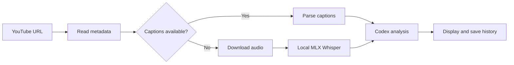

# YouTubeInsight

A native macOS client that turns a YouTube URL into a concise, structured
analysis and keeps a local, searchable history.

[简体中文](README.md) · English

## Features

- Accepts standard YouTube, YouTube Shorts, live, and `youtu.be` URLs.
- Uses human or automatic YouTube captions when available.
- Downloads audio and transcribes it locally with MLX Whisper when captions are unavailable.
- Uses the signed-in Codex CLI to produce an overview and five numbered points.
- Enforces a 500-character maximum for every analysis.
- Saves the URL, title, date, transcript source, transcript, and analysis locally.
- Supports Simplified Chinese, Traditional Chinese, English, Japanese, Korean,
  Spanish, French, and German. Both the interface and new analyses follow the
  macOS language.

## How it works



History is stored at:

```text
~/Library/Application Support/YouTubeInsight/history.json
```

Temporary audio is removed after each run. Whisper models and tool caches remain
on disk so later runs do not download them again.

## Requirements

- Apple Silicon Mac
- macOS 13 or later
- Swift 5.10 or later for building
- [`uv`](https://docs.astral.sh/uv/) for isolated `yt-dlp`, `mlx-whisper`, and
  static ffmpeg fallback execution
- Codex CLI installed and signed in

Install the runtime prerequisites:

```bash
brew install uv
codex login
```

## Build and run

```bash
chmod +x scripts/build-app.sh scripts/run-tests.sh
./scripts/run-tests.sh
./scripts/build-app.sh
open dist/YouTubeInsight.app
```

Optional end-to-end smoke test:

```bash
chmod +x scripts/smoke-test.sh
./scripts/smoke-test.sh "https://www.youtube.com/watch?v=XYgm-dNNrR8"
```

The first captionless video downloads the selected Whisper model. Subsequent
runs reuse the model cache.

## Language behavior

The app follows the macOS system language and respects per-app language
selection in System Settings. Unsupported languages fall back to English.
Restart the app after changing its language.

Saved analyses are not translated retroactively. Reanalyze a URL to create a
result in the newly selected language.

## Privacy and security

- Speech transcription runs locally.
- Analysis history remains on the Mac.
- The transcript is sent to the locally authenticated Codex CLI for analysis.
- YouTube, package, model, and Codex access require network connectivity.

See [SECURITY.md](SECURITY.md) for the trust model and reporting instructions.

## Troubleshooting

- **Missing `uvx`:** run `brew install uv`.
- **Codex analysis fails:** run `codex login` and confirm the configured model is
  available to the account.
- **First transcription is slow:** wait for the selected Whisper model to finish
  downloading.
- **macOS cannot verify the developer:** locally built packages are ad-hoc signed
  and not notarized. Right-click the app and choose **Open**.

## Contributing

See [CONTRIBUTING.md](CONTRIBUTING.md). Please report security concerns using
[SECURITY.md](SECURITY.md), not a public issue containing sensitive data.

## License

[MIT](LICENSE)
