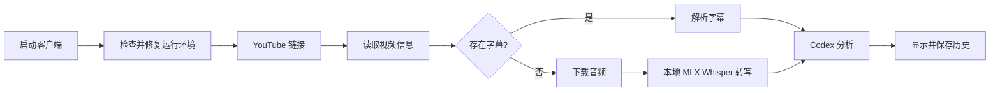

# YouTubeInsight

一个原生 macOS YouTube 视频分析客户端。

[English](README.en.md) · 简体中文

## 功能

- 输入常见形式的 YouTube、YouTube Shorts 或 `youtu.be` 链接。
- 启动时检查运行环境；依赖缺失或损坏时自动尝试修复，并在无法自动处理时给出明确提示。
- 优先下载视频已有的人工或自动字幕。
- 没有字幕时，自动下载音频并使用 Apple Silicon 优化的 MLX Whisper 本地转写。
- 调用本机已登录的 Codex CLI 生成结构化分析。
- 最终结果固定为“总览 + 5条编号要点”，全文不超过500字。
- 根据 macOS 系统语言自动显示简体中文、繁体中文、英语、日语、韩语、西班牙语、法语或德语；分析结果使用同一语言。
- 自动保存视频链接、标题、分析时间、转写稿和最终分析。
- 支持查看历史、复制分析、打开原视频和删除记录。
- 在侧边栏显示应用版本和构建号；源码或资源更新后重新构建时，构建号自动更新。

## 工作流程



历史记录保存在：

```text
~/Library/Application Support/YouTubeInsight/history.json
```

## 运行要求

- Apple Silicon Mac
- macOS 13 或更高版本
- Swift 5.10 或更高版本（仅构建时需要）
- `uv`：负责隔离运行最新版 `yt-dlp`、`mlx-whisper` 和静态 ffmpeg 回退
- 已安装并登录的 Codex CLI

应用会在启动时验证这些依赖。若 Homebrew 可用，会自动安装或修复缺失的
`uv`、Node.js/npm 和 Codex CLI；Codex 账号登录仍需用户授权：

```bash
brew install uv
codex login
```

## 快速开始

1. 下载或构建 `YouTubeInsight.app`。
2. 打开客户端并粘贴公开的 YouTube 视频链接。
3. 点击“开始分析”，等待字幕读取或本地转写完成。
4. 在右侧查看不超过500字的分析，在左侧重新打开历史记录。

## 构建客户端

```bash
chmod +x scripts/build-app.sh
chmod +x scripts/run-tests.sh
./scripts/run-tests.sh
./scripts/build-app.sh
open dist/YouTubeInsight.app
```

正式版本由 `Resources/Info.plist` 中的 `CFBundleShortVersionString` 管理。
构建号根据源码和资源的最近更新时间自动生成，例如
`1.3.0（构建 20260727103000）`。相同内容重复构建时保持不变，也可以通过
`YOUTUBEINSIGHT_BUILD_NUMBER` 环境变量覆盖。

可选的真实视频端到端检查：

```bash
chmod +x scripts/smoke-test.sh
./scripts/smoke-test.sh "https://www.youtube.com/watch?v=XYgm-dNNrR8"
```

只检查启动环境：

```bash
./scripts/smoke-test.sh --environment-only
```

## 首次分析说明

有字幕的视频通常很快。无字幕的视频会在首次使用时下载
`whisper-large-v3-turbo` 模型，模型较大；下载完成后会保存在 Hugging Face
缓存中，后续无需重复下载。

应用优先使用系统中正常工作的 ffmpeg。如果 Homebrew ffmpeg 因动态库版本
问题无法运行，应用会通过 `imageio-ffmpeg` 自动准备隔离的静态版本，不修改
现有 Homebrew 安装。

Whisper 使用纯文本文件交付转写结果，避免模型输出中的非标准 JSON 数值导致
有效文字被误判为空。

## 支持的语言

客户端使用 macOS 的系统语言或按应用指定的语言。支持：

- 简体中文、繁体中文
- 英语、日语、韩语
- 西班牙语、法语、德语

系统语言不在列表中时使用英语。更改语言后需要重新打开客户端；历史分析不会
被自动翻译，重新分析相同链接即可生成新语言结果。

## 隐私

- 音频转写在本机完成。
- 历史记录只保存在本机。
- 最终转写稿会交给本机登录的 Codex CLI 生成分析；具体数据处理方式取决于
  Codex 账号和服务配置。
- 临时下载的音频会在任务结束后删除；Whisper 模型和工具缓存会保留以供复用。

更多信息请阅读 [SECURITY.md](SECURITY.md)。

## 常见问题

### 提示缺少 `uvx`

点击初始化界面的“重试”，应用会通过 Homebrew 自动修复。若 Homebrew 本身
未安装，请先安装 Homebrew。

### 提示“无法准备 npm”

macOS 从 Finder 启动应用时提供的 PATH 比终端精简。当前版本会自动补齐
Homebrew 和用户工具目录，并且只在 Codex CLI 缺失、确实需要安装时才检查
npm，不会因为 GUI 环境找不到 Node 而重装 npm。

### Codex 无法生成分析

确认 Codex CLI 已安装、已登录，并且设置页中的模型可供当前账号使用：

```bash
codex login
```

### 首次处理无字幕视频很慢

首次运行需要下载 MLX Whisper 模型。下载完成后，后续任务会复用本地缓存。

### macOS 提示无法验证开发者

本地构建的应用使用 ad-hoc 签名，未经过 Apple 公证。右键应用并选择“打开”。

## 参与贡献

提交修改前请阅读 [CONTRIBUTING.md](CONTRIBUTING.md)。安全问题请按
[SECURITY.md](SECURITY.md) 中的方式报告，不要公开包含敏感信息的 Issue。

## 许可证

[MIT License](LICENSE)
