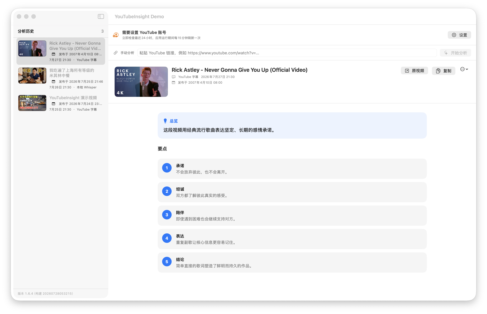
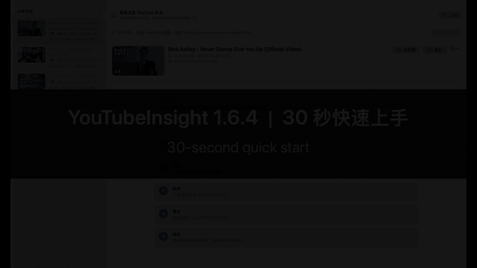
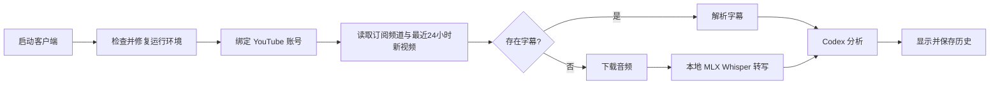

# YouTubeInsight

一个原生 macOS YouTube 视频分析客户端。

[English](README.en.md) · 简体中文

## 界面预览



截图使用公开演示数据，不包含真实 YouTube 账号或个人分析历史。

## 30 秒使用演示

[](docs/media/YouTubeInsight-quickstart.mp4)

点击上方动图可打开高清 MP4 视频。基本使用方法：

1. **手动分析**：把 YouTube、Shorts 或 `youtu.be` 链接粘贴到顶部输入框，
   点击“开始分析”，完成后结果会自动保存到左侧历史记录。
2. **自动分析**：在设置中导入 Google OAuth 桌面应用 JSON 并绑定账号，
   客户端会检查最近24小时的订阅更新，并在运行期间每15分钟刷新。
3. **查看结果**：在左侧点击视频封面或标题，查看短总览和5条要点；顶部按钮
   可以打开原视频或复制分析内容。

## 功能

- 通过 Google OAuth 在系统浏览器中绑定 YouTube 账号，仅申请只读权限。
- 启动后读取全部订阅频道，自动发现最近24小时发布的新视频。
- 应用运行期间每15分钟刷新一次；也可随时手动刷新。
- 最多并发检查6个订阅频道；发现与分析同时进行，新视频按发布时间从新到旧进入单路分析，已保存或本次已尝试的视频自动去重。
- 无需绑定账号也可以随时粘贴单个 YouTube、Shorts 或 `youtu.be` 链接手动分析。
- 启动时检查运行环境；依赖缺失或损坏时自动尝试修复，并在无法自动处理时给出明确提示。
- 优先下载视频已有的人工或自动字幕。
- 没有字幕时，自动下载音频并使用 Apple Silicon 优化的 MLX Whisper 本地转写。
- 调用本机已登录的 Codex CLI 生成结构化分析。
- 可在设置中选择 Codex Sol、Terra、Luna 或自定义模型，并设置低、中、高、
  超高、Max 或 Ultra 推理强度；每个自动分析任务都会使用当前选项。
- 最终结果以“短总览卡片 + 5条编号要点卡片”展示，使用通俗短句、标签和箭头流程，通常为250–350字且不超过400字。
- 根据 macOS 系统语言自动显示简体中文、繁体中文、英语、日语、韩语、西班牙语、法语或德语；分析结果使用同一语言。
- 自动保存视频链接、标题、封面地址、分析时间、转写稿和最终分析，并在历史列表和详情中显示封面。
- 支持查看历史、复制分析、打开原视频和删除记录。
- 在侧边栏显示应用版本和构建号；源码或资源更新后重新构建时，构建号自动更新。
- 启动时默认将主窗口最大化到当前屏幕的可用区域，不会自动进入全屏空间。

## 工作流程



历史记录保存在：

```text
~/Library/Application Support/YouTubeInsight/history.json
```

## 运行要求

- Apple Silicon Mac
- macOS 13 或更高版本
- Swift 5.10 或更高版本（仅构建时需要）
- `uv`：负责隔离运行最新版 `yt-dlp`、`mlx-whisper` 和静态 ffmpeg 回退
- 已安装并登录的 Codex CLI
- 已启用 YouTube Data API v3 的 Google Cloud 项目
- “桌面应用”类型的 Google OAuth 客户端凭据 JSON

应用会在启动时验证这些依赖。若 Homebrew 可用，会自动安装或修复缺失的
`uv`、Node.js/npm 和 Codex CLI；Codex 账号登录仍需用户授权：

```bash
brew install uv
codex login
```

## 快速开始

1. 在 [Google Cloud Console](https://console.cloud.google.com/apis/library/youtube.googleapis.com)
   启用 YouTube Data API v3。
2. 在“API 和服务 → 凭据”中创建“桌面应用”OAuth 客户端，下载 JSON 文件。
3. 打开客户端设置，导入该 JSON，点击“绑定账号”并在系统浏览器中授权。
4. 客户端立即并发补抓最近24小时的订阅新视频；每发现一批就按发布时间从新到旧排队，并在继续发现的同时逐条分析和保存。
5. 后续保持应用运行即可每15分钟自动刷新，也可点击“立即刷新”。

如果只需要分析单个视频，可以跳过账号绑定，直接在主界面的“手动分析”
输入框粘贴 YouTube 链接并点击“分析”。手动与定时任务共用当前 Codex 模型、
推理强度、字幕/Whisper 转写流程和历史记录。

OAuth 使用 PKCE 和本机回环地址接收授权结果。访问令牌与刷新令牌保存在
macOS 钥匙串中；解除绑定时会撤销并删除令牌。

### 推荐安装位置与钥匙串授权

请将 `YouTubeInsight.app` 固定放在 `/Applications` 中，并始终从“应用程序”
目录启动。不要交替运行 DMG、下载目录或源码 `dist` 目录中的副本，否则
macOS 可能把它们识别为不同应用并重复请求钥匙串权限。

如果已经选择“始终允许”但仍然反复提示：

1. 退出 YouTubeInsight。
2. 打开“钥匙串访问”，选择“登录 → 密码”。
3. 搜索并双击 `com.local.YouTubeInsight.YouTubeOAuth`。
4. 在“访问控制”中点击 `+`，添加 `/Applications/YouTubeInsight.app`，
   然后保存。

本地发布包使用 ad-hoc 签名，重新构建或升级后代码身份会变化，因此新版本
首次访问时仍可能需要再次确认。选择“允许所有应用程序访问此项目”可以避免
确认，但会允许其他本机应用读取 YouTube 令牌，存在安全风险，不建议使用。
使用固定的 Apple Developer 签名可让升级版本保持稳定的应用身份。

## 构建客户端

```bash
chmod +x scripts/build-app.sh
chmod +x scripts/run-tests.sh
./scripts/run-tests.sh
./scripts/build-app.sh
open dist
```

构建后将 `YouTubeInsight.app` 拖入“应用程序”目录，再从该位置启动。

正式版本由 `Resources/Info.plist` 中的 `CFBundleShortVersionString` 管理。
构建号根据源码和资源的最近更新时间自动生成，例如
`1.6.4（构建 20260728103000）`。相同内容重复构建时保持不变，也可以通过
`YOUTUBEINSIGHT_BUILD_NUMBER` 环境变量覆盖。

可选的真实视频端到端检查：

```bash
chmod +x scripts/smoke-test.sh
./scripts/smoke-test.sh "https://www.youtube.com/watch?v=XYgm-dNNrR8"
```

只检查启动环境：

```bash
./scripts/smoke-test.sh --environment-only
```

## 自动分析说明

客户端每次扫描都会分页读取全部订阅频道，再读取各频道的上传列表。扫描使用
低配额的 `subscriptions.list`、`channels.list` 和 `playlistItems.list`，
避免高成本搜索接口。应用关闭时不会继续运行；再次启动会重新检查最近24小时，
因此不会依赖后台常驻。

有字幕的视频通常很快。无字幕的视频会在首次使用时下载
`whisper-large-v3-turbo` 模型，模型较大；下载完成后会保存在 Hugging Face
缓存中，后续无需重复下载。

从 1.6.3 起，字幕和音频下载会复用首次读取的视频元数据，避免重复解析
YouTube 页面；无字幕视频优先下载适合语音识别的低码率音轨。内置 Codex
模型使用轻量、无会话状态的调用方式，减少插件、规则和配置加载时间。无字幕
视频的主要耗时仍是本地 Whisper 转写，可在设置中改用 `small` 或 `tiny`
模型换取更快速度。

应用优先使用系统中正常工作的 ffmpeg。如果 Homebrew ffmpeg 因动态库版本
问题无法运行，应用会通过 `imageio-ffmpeg` 自动准备隔离的静态版本，不修改
现有 Homebrew 安装。

Whisper 使用纯文本文件交付转写结果，避免模型输出中的非标准 JSON 数值导致
有效文字被误判为空。

## 支持的语言

客户端使用 macOS 的系统语言或按应用指定的语言。支持：

- 简体中文、繁体中文
- 英语、日语、韩语
- 西班牙语、法语、德语

系统语言不在列表中时使用英语。更改语言后需要重新打开客户端；历史分析不会
被自动翻译，重新分析相同链接即可生成新语言结果。

## 隐私

- 音频转写在本机完成。
- 历史记录只保存在本机。
- YouTube OAuth 令牌保存在 macOS 钥匙串中，应用仅申请
  `youtube.readonly` 权限。
- 订阅频道和上传列表通过 YouTube Data API 获取。
- 最终转写稿会交给本机登录的 Codex CLI 生成分析；具体数据处理方式取决于
  Codex 账号和服务配置。
- 临时下载的音频会在任务结束后删除；Whisper 模型和工具缓存会保留以供复用。

更多信息请阅读 [SECURITY.md](SECURITY.md)。

## 常见问题

### 提示缺少 `uvx`

点击初始化界面的“重试”，应用会通过 Homebrew 自动修复。若 Homebrew 本身
未安装，请先安装 Homebrew。

### 提示“无法准备 npm”

macOS 从 Finder 启动应用时提供的 PATH 比终端精简。当前版本会自动补齐
Homebrew 和用户工具目录，并且只在 Codex CLI 缺失、确实需要安装时才检查
npm，不会因为 GUI 环境找不到 Node 而重装 npm。

### Codex 无法生成分析

确认 Codex CLI 已安装、已登录，并且设置页中的模型可供当前账号使用：

```bash
codex login
```

不同 Codex 账号可用的模型和推理强度可能不同。如果所选组合不受支持，请在
设置中切换为 `Sol + 中`，或使用账号实际可用的自定义模型 ID。

### YouTube 账号无法绑定

确认 OAuth 客户端类型为“桌面应用”，对应 Google Cloud 项目已启用
YouTube Data API v3，并且当前 Google 账号已加入 OAuth 测试用户。公共分发
前还需要按 Google 要求完成 OAuth 应用验证。

### 首次处理无字幕视频很慢

首次运行需要下载 MLX Whisper 模型。下载完成后，后续任务会复用本地缓存。

### macOS 提示无法验证开发者

本地构建的应用使用 ad-hoc 签名，未经过 Apple 公证。右键应用并选择“打开”。

## 参与贡献

提交修改前请阅读 [CONTRIBUTING.md](CONTRIBUTING.md)。安全问题请按
[SECURITY.md](SECURITY.md) 中的方式报告，不要公开包含敏感信息的 Issue。

## 许可证

[MIT License](LICENSE)
